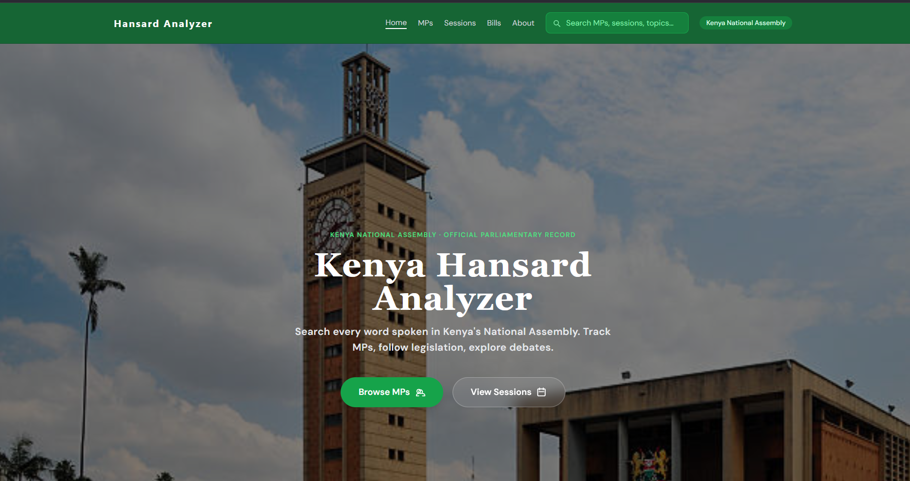
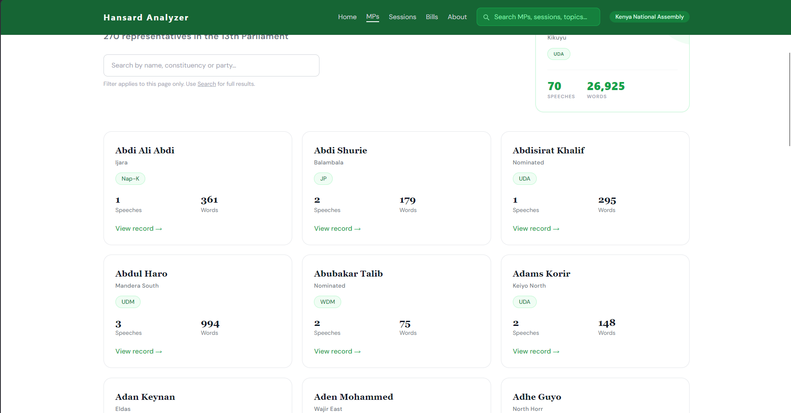
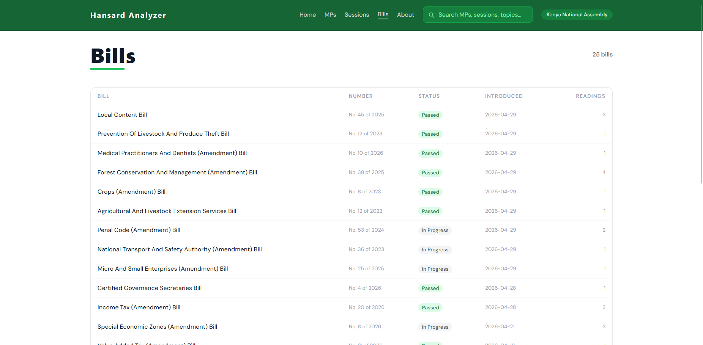
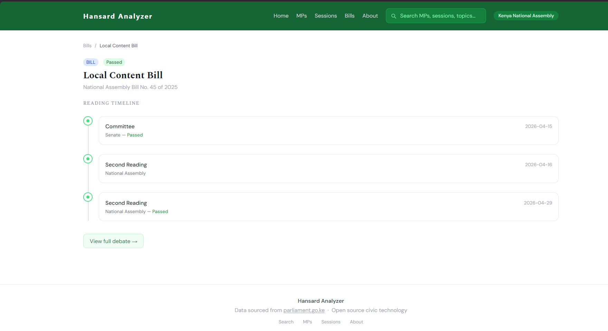

# Kenya Hansard Analyzer — Parliamentary Intelligence Platform

Kenya Hansard Analyzer is a civic intelligence platform that transforms Kenya's official parliamentary records (Hansard) into structured, searchable, and analyzable data. The project is built with Python, Flask, and SQLite, featuring an AI-powered pipeline that extracts agenda items, classifies topics, and generates plain-language summaries of parliamentary debates. All data is processed from official unstructured PDFs and served through a clean, modern web interface.

## Contributor
Isaac Ndungu

## Project Brief
Kenya Hansard Analyzer is a data-driven platform designed to increase parliamentary transparency and democratic accountability. Traditionally, Hansard records are published as hundreds of pages of unstructured PDFs, making them nearly impossible for citizens, journalists, or researchers to search or analyze effectively.

The platform follows an "Agenda-First" architecture. Unlike simple keyword search tools, it identifies the specific unit of debate (a Bill, Motion, Petition, or Statement) and links every speech to that context. This allows users to see exactly what was debated, who said what, and what the final outcome was, without the noise of unrelated mentions.

The application is structured around four main content areas:
*   **Search & Discovery** - Filter by agenda type (Bills, Motions, etc.), topic (Healthcare, Finance), or keyword.
*   **MP Scorecards** - Detailed participation profiles for every Member of Parliament, including speech counts, topic focus, and attendance.
*   **Bills Tracker** - A specialized view for tracking legislation through its various readings and committee stages.
*   **AI Insights** - Automated, Gemini-powered summaries and sentiment analysis for complex parliamentary sessions.

## Core Features

### Home & Search
*   **Dashboard** - High-level stats on the latest sessions, active bills, and most debated topics.
*   **Agenda-First Search** - Advanced filtering system that prioritizes official agenda items over raw speech text to ensure authoritative results.

### MP Scorecards & Participation
*   **Profile Pages** - Individual metrics for all 350+ MPs in the National Assembly.
*   **Activity Log** - A reverse-chronological timeline of every contribution an MP has made in the House.
*   **Sentiment Analysis** - VADER-based scoring to visualize whether an MP's contributions are constructive, neutral, or critical.

### Bills & Legislation
*   **Status Tracking** - Clear indicators for whether a bill is at First Reading, Second Reading, or has been passed/rejected.
*   **Sponsorship** - Identifying which MPs or Committees are championing specific pieces of legislation.

### AI Summaries & Topic Intelligence
*   **Debate Summarization** - Gemini-powered plain-language summaries for every agenda item, cached for performance.
*   **Topic Classification** - Automated tagging of debates into categories like Healthcare, Education, Security, and Finance based on the agenda title.

### Transparency & Ethics
*   **Data Provenance** - Every record is linked back to the original official PDF page on parliament.go.ke.
*   **Non-Partisan Analysis** - Identical methodology applied to all sessions and MPs regardless of political affiliation.

## Technologies Used
*   **Python 3.11** (Core Logic)
*   **Flask** (Web Framework)
*   **SQLite** (Relational Database)
*   **Google Gemini API** (Generative AI Summaries)
*   **Tailwind CSS** (UI Styling)
*   **Chart.js** (Data Visualization)
*   **pdfplumber** (PDF Data Extraction)
*   **NLTK/VADER** (Sentiment Analysis)

## Usage Instructions
1.  **Clone the repository**
    ```bash
    git clone https://github.com/isaac-ndungu/hansard_analyzer.git
    ```
2.  **Navigate to the project folder**
    ```bash
    cd hansard_analyzer
    ```
3. **Create and activate a virtual environment**
    - On Windows:
    ```bash
    python -m venv env
    source env\Scripts\activate
    ```
    - On macOS/Linux
    ```
    python3 -m venv venv
    source venv/bin/activate
    ```


4.  **Install dependencies**
    ```bash
    pip install -r requirements.txt
    ```
5.  **Set up environment variables**
    Create a `.env` file and add your `GEMINI_API_KEY`.
6.  **Run the application**
    ```bash
    python app.py
    ```
7.  **Access the platform**
    Open `http://127.0.0.1:5000` in your web browser.

## Screenshots
 
  
  
 

## Future Improvements
*   **Historical Data Expansion** - Ingesting records back to 2022 to provide long-term trend analysis.
*   **Senate Support** - Expanding the pipeline to include the Senate Hansards for a complete view of Parliament.
*   **Public API** - Creating a REST API (FastAPI) for researchers and developers to access structured parliamentary data.
*   **Voting Record Extraction** - Automating the extraction of division lists and voting outcomes from speech text.
*   **MP Photo Integration** - Linking official MP portraits for a more visual experience.
